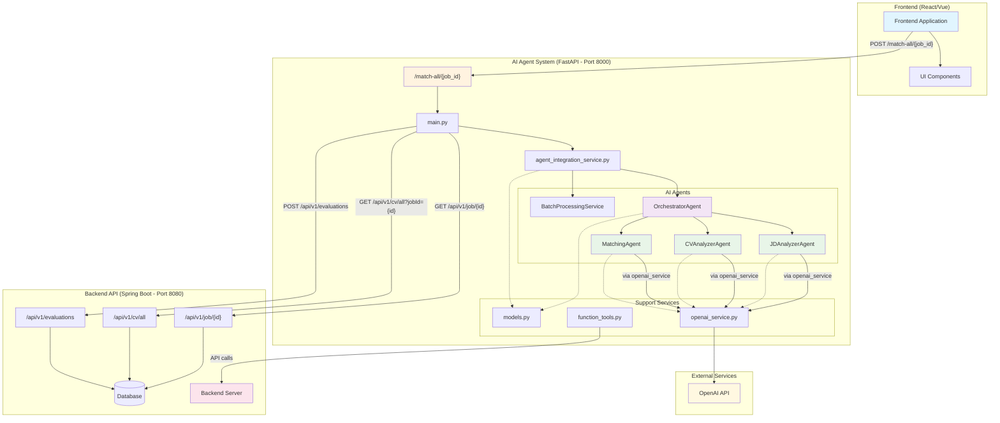
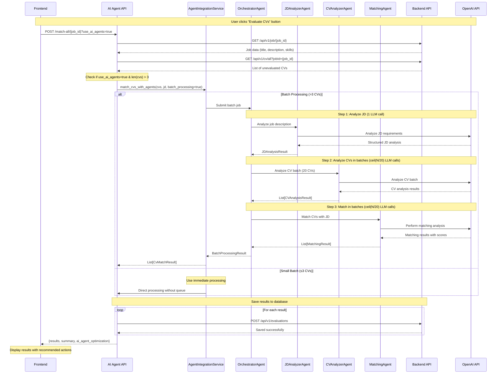

# AI Agent System Architecture

## 🏗️ Kiến trúc tổng thể hệ thống



## 🔄 Flow chi tiết khi gọi API `/match-all/{job_id}`



## 📊 Tối ưu hóa LLM calls

```mermaid
graph LR
    subgraph "Traditional Method"
        T1[1 JD Analysis] --> T2[CV1 Analysis]
        T2 --> T3[CV1 Matching]
        T3 --> T4[CV2 Analysis]
        T4 --> T5[CV2 Matching]
        T5 --> T6[... CVN Analysis]
        T6 --> T7[CVN Matching]
        T7 --> TR[Total: 1 + 2N calls]
    end
    
    subgraph "AI Agent Batch Method"
        A1[1 JD Analysis] --> A2[Batch CV Analysis<br/>ceil(N/20) calls]
        A2 --> A3[Batch Matching<br/>ceil(N/20) calls]
        A3 --> AR[Total: 1 + 2×ceil(N/20) calls]
    end
    
    TR -.->|"95% reduction<br/>for 100 CVs"| AR
    
    style TR fill:#ffcdd2
    style AR fill:#c8e6c9
```

## 🎯 API Response Structure

```json
{
  "job_id": "job_123",
  "total_candidates": 50,
  "results": [
    {
      "cv_id": "cv_456",
      "score": 85.5,
      "explanation": "Strong technical match...",
      "recommended_action": "send_contact_email",
      "action_reason": "Ứng viên rất tiềm năng..."
    }
  ],
  "summary": {
    "send_contact_email": 12,
    "save_cv": 25,
    "no_recommendation": 13
  },
  "processing_method": "ai_agents_batch",
  "ai_agent_optimization": {
    "enabled": true,
    "batch_size": 20,
    "estimated_llm_calls_saved": 87
  }
}
```

## 🔧 Key Components

### 1. **Frontend Integration**
- Gọi API `/match-all/{job_id}` với parameter `use_ai_agents=true`
- Nhận kết quả với recommended actions
- Hiển thị summary và optimization metrics

### 2. **AI Agent System**
- **OrchestratorAgent**: Điều phối workflow
- **JDAnalyzerAgent**: Phân tích job description  
- **CVAnalyzerAgent**: Phân tích CVs theo batch
- **MatchingAgent**: Thực hiện matching với scoring

### 3. **Backend Integration**
- Cung cấp job data và CV data
- Lưu trữ kết quả evaluation
- Filter CVs chưa được đánh giá

### 4. **Performance Optimization**
- **Traditional**: 1 + 2N LLM calls (N = số CVs)
- **AI Agent Batch**: 1 + 2×ceil(N/batch_size) calls
- **Example**: 100 CVs: 201 calls → 11 calls (95% reduction)
